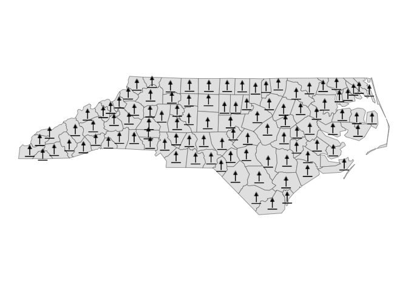

<!-- README.md is generated from README.Rmd. Please edit that file -->

# maplayer

<!-- badges: start -->

[](https://CRAN.R-project.org/package=maplayer)
[](https://lifecycle.r-lib.org/articles/stages.html#experimental)
[](https://opensource.org/licenses/MIT)
<!-- badges: end -->

The goal of maplayer is to provide a consistent set of functions for
creating map layers using simple feature ({sf}) data, the {ggplot2}
package, and a variety of ggplot2 extension packages.

The functions in maplayer started as part of the {overedge} package and
re-exports several key functions from that package. It also includes
layer functions that had been part of the birdseyeview package. The
intention is to consoldiate all of the map layer functions into a single
package as the first step in the process of splitting overedge into
multiple packages.

## Installation

You can install the development version of maplayer like so:

``` r
remotes::install_github("elipousson/maplayer")
```

## Example

This is a basic example which shows you how to solve a common problem:

``` r
library(maplayer)
library(ggplot2)
library(sf)
#> Linking to GEOS 3.9.1, GDAL 3.4.2, PROJ 8.2.1; sf_use_s2() is TRUE
```

### Make icon maps with sf objects and ggplot2

`layer_icon` wraps \[ggsvg::geom_point_svg()\] to provide an convenient
way to make icon maps.

You can create maps using a single named icon that matches one of the
icons in \[overedge::map_icons\].

``` r
nc <- st_read(system.file("shape/nc.shp", package = "sf"))
#> Reading layer `nc' from data source 
#>   `/Library/Frameworks/R.framework/Versions/4.2-arm64/Resources/library/sf/shape/nc.shp' 
#>   using driver `ESRI Shapefile'
#> Simple feature collection with 100 features and 14 fields
#> Geometry type: MULTIPOLYGON
#> Dimension:     XY
#> Bounding box:  xmin: -84.32385 ymin: 33.88199 xmax: -75.45698 ymax: 36.58965
#> Geodetic CRS:  NAD27
nc <- st_transform(nc, 3857)
theme_set(theme_void())

nc_map <-
  ggplot() +
  geom_sf(data = nc)

nc_map +
  layer_icon(data = nc, icon = "point-start", size = 8)
```


