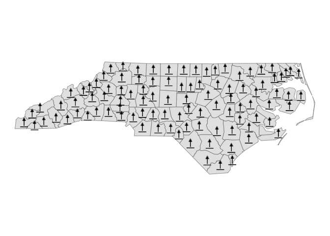
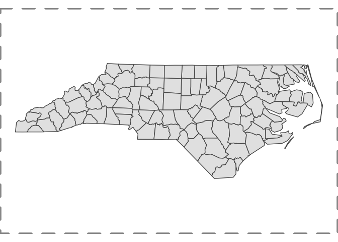
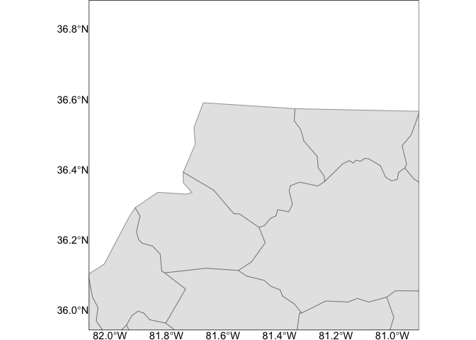
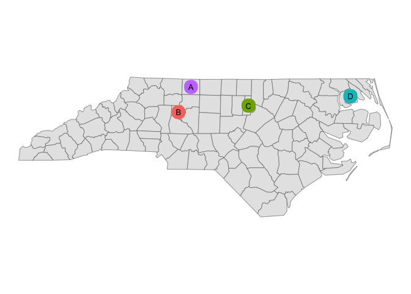
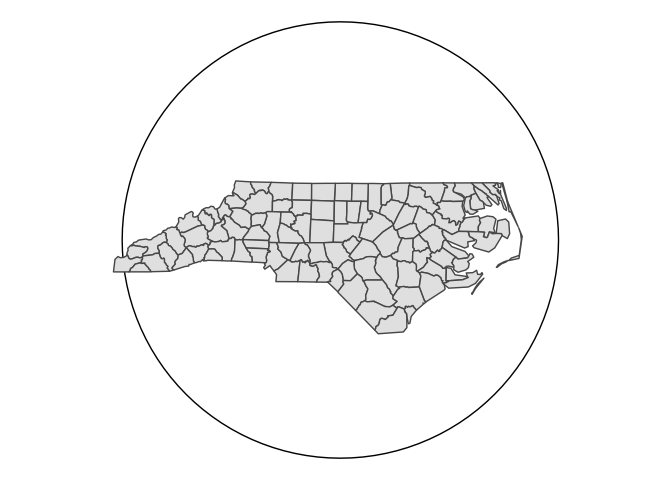
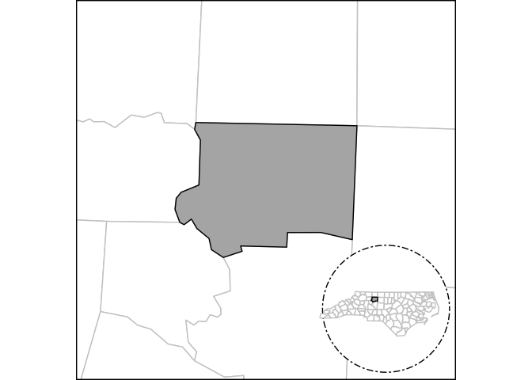

# maplayer

The goal of maplayer is to provide a consistent set of functions for
creating map layers using simple feature
([{sf}](https://r-spatial.github.io/sf/)) data, the
[{ggplot2}](https://ggplot2.tidyverse.org/) package, and a variety of
ggplot2 extension packages.

## Basic functions

The main layers that work with both a data and location sf object are:

- [`layer_location_data()`](https://elipousson.github.io/maplayer/reference/layer_location_data.md)
- [`layer_location()`](https://elipousson.github.io/maplayer/reference/layer_location.md)
- [`layer_location_context()`](https://elipousson.github.io/maplayer/reference/layer_location_context.md)

There are several layers that can work with a single sf object as the
input data:

- [`layer_markers()`](https://elipousson.github.io/maplayer/reference/layer_markers.md)
- [`layer_numbers()`](https://elipousson.github.io/maplayer/reference/layer_markers.md)
- [`layer_frame()`](https://elipousson.github.io/maplayer/reference/layer_frame.md)
- [`layer_scaled()`](https://elipousson.github.io/maplayer/reference/layer_scaled.md)
- [`layer_mask()`](https://elipousson.github.io/maplayer/reference/layer_mask.md)
- [`layer_neatline()`](https://elipousson.github.io/maplayer/reference/layer_neatline.md)

Finally, there are layers that require additional packages (listed in
Suggests):

- [`layer_labelled()`](https://elipousson.github.io/maplayer/reference/layer_labelled.md)
  optionally uses [{ggrepel}](https://ggrepel.slowkow.com/) or
  [{geomtextpath}](https://allancameron.github.io/geomtextpath/)
- [`layer_mapbox()`](https://elipousson.github.io/maplayer/reference/layer_mapbox.md)
  uses [{mapboxapi}](https://walker-data.com/mapboxapi/) (requires an
  API key)
- [`layer_marked()`](https://elipousson.github.io/maplayer/reference/layer_marked.md)
  uses [{ggforce}](https://ggforce.data-imaginist.com/)
- [`layer_icon()`](https://elipousson.github.io/maplayer/reference/layer_icon.md)
  uses [{ggsvg}](https://coolbutuseless.github.io/package/ggsvg/)
- [`layer_inset()`](https://elipousson.github.io/maplayer/reference/layer_inset.md)
  uses [{patchwork}](https://patchwork.data-imaginist.com/) or
  optionally [{figpatch}](https://bradyajohnston.github.io/figpatch/)
  (for
  [`stamp_inset_img()`](https://elipousson.github.io/maplayer/reference/layer_inset.md))

The package also allows the optional use of packages designed for
transforming spatial data or modifying ggplot2 maps. These include:

- [{smoothr}](https://strimas.com/smoothr/) (required to use the
  smooth_params argument)
- [{ggfx}](https://ggfx.data-imaginist.com/) (required to use the
  shadow_params argument)

Many of the functions in {maplayer} were originally developed for the
[{overedge}](chttps://elipousson.github.io/overedge/) package or before
that for the
[{mapbaltimore}](https://elipousson.github.io/mapbaltimore/) package.
The {overedge} package has been split up into three smaller packages
including {maplayer},
[{getdata}](https://elipousson.github.io/getdata/), and
[{sfext}](https://elipousson.github.io/sfext/).

## Installation

You can install the development version of maplayer like so:

``` r

pak::pkg_install("elipousson/maplayer")
```

## Example

``` r

library(maplayer)
library(ggplot2)
library(sf)
#> Linking to GEOS 3.11.0, GDAL 3.5.3, PROJ 9.1.0; sf_use_s2() is TRUE
```

### Add icons to a map

[`layer_icon()`](https://elipousson.github.io/maplayer/reference/layer_icon.md)
wraps
[`ggsvg::geom_point_svg()`](https://rdrr.io/pkg/ggsvg/man/geom_point_svg.html)
to provide an convenient way to make icon maps.

You can create maps using a single named icon that matches one of the
icons in `map_icons`.

``` r

nc <- read_sf(system.file("shape/nc.shp", package = "sf"))
nc <- st_transform(nc, 3857)
theme_set(theme_void())

nc_map <-
  ggplot() +
  geom_sf(data = nc)

nc_map +
  layer_icon(data = nc, icon = "point-start", size = 8)
```



### Add a neatline to a map

[`layer_neatline()`](https://elipousson.github.io/maplayer/reference/layer_neatline.md)
hides major grid lines and axis label by default. The function is useful
to draw a neatline around a map at a set aspect ratio.

``` r

nc_map +
  layer_neatline(
    data = nc,
    asp = "6:4",
    color = "gray60", linewidth = 2, linetype = "dashed"
  )
```



[`layer_neatline()`](https://elipousson.github.io/maplayer/reference/layer_neatline.md)
can also be used to focus on a specific area of a map with the option to
apply a buffer as a distance or ratio of the diagonal distance for the
input data. The `label_axes` and `hide_grid` parameters will not
override a set ggplot theme.

``` r

nc_map +
  layer_neatline(
    data = nc[1, ],
    diag_ratio = 0.5,
    asp = 1,
    color = "black",
    label_axes = "--EN",
    hide_grid = FALSE,
    expand = FALSE
  )
```



### Add labels or numbers to a map

``` r

nc_map +
  layer_labelled(
    data = nc[c(10, 20, 30, 40), ],
    geom = "sf_label",
    mapping = aes(label = NAME)
  )
```


``` r

nc_map +
  layer_numbers(
    data = nc[c(10, 20, 30, 40), ],
    aes(fill = NAME),
    num_style = "Alph",
    size = 3.5
  ) +
  guides(fill = "none")
```



### Create a frame around a feature

``` r

circle_nc <-
  ggplot(data = nc) +
  # layer_frame requires a data arg if neatline = TRUE
  layer_frame(data = nc, style = "circle") +
  # layer_location_data can inherit data
  layer_location_data()

circle_nc
```



### Create an inset map

``` r

nc_context <-
  layer_frame(
    data = nc,
    linetype = "twodash",
    neatline = FALSE,
    basemap = TRUE
  ) +
  layer_location_context(
    location = nc[25, ],
    context = nc,
    context_params = list(fill = "white", color = "gray80", alpha = 1),
    neatline = FALSE
  )

nc_context +
  layer_neatline(
    data = nc[25, ],
    dist = 15,
    unit = "mi",
    asp = 1
  ) +
  layer_inset(
    inset = nc_context,
    scale = 1.5
  )
```


